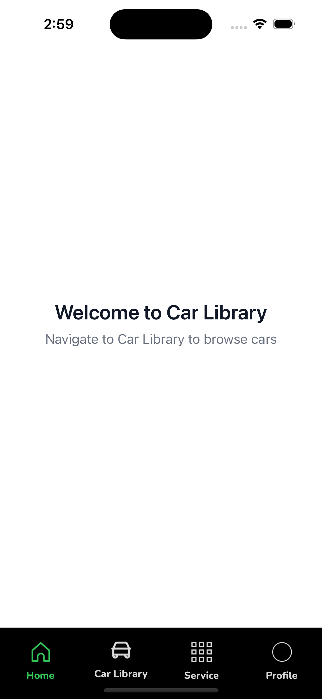
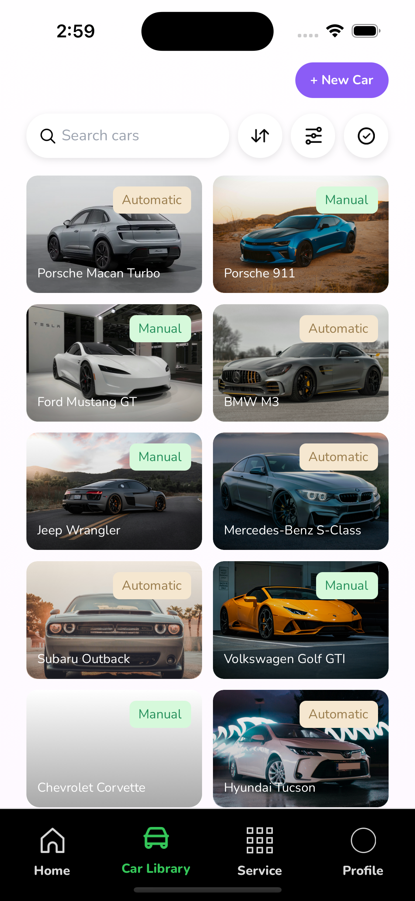
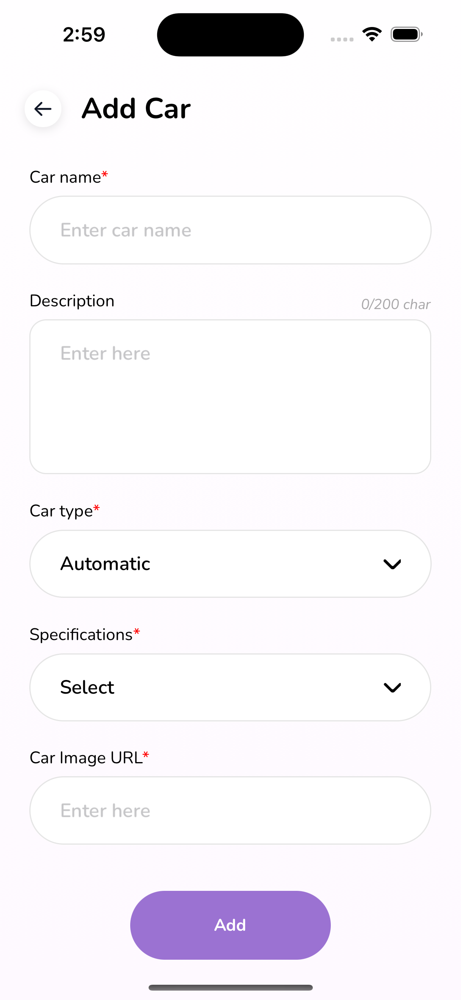
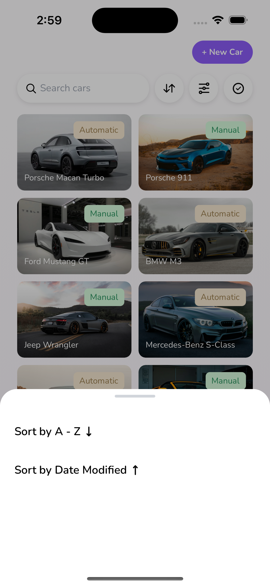
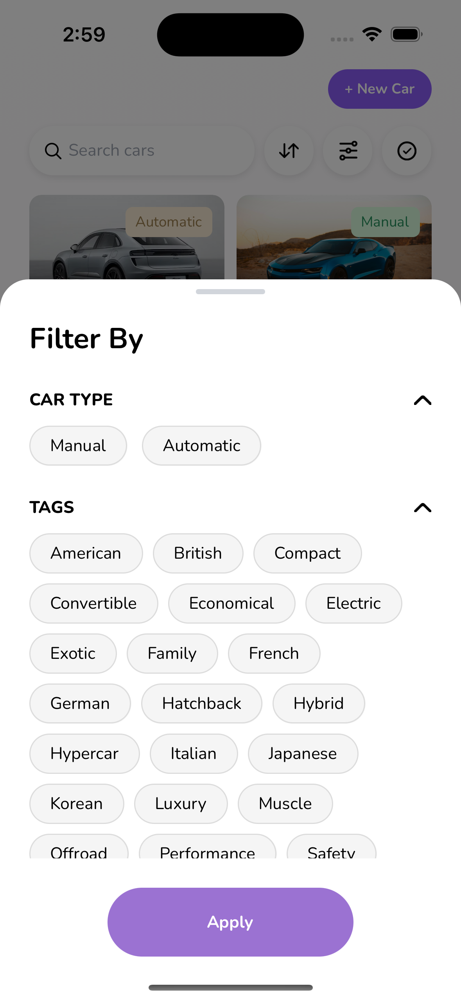
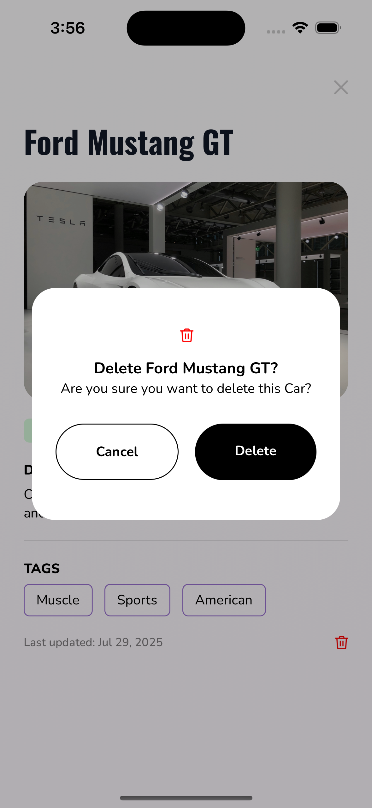

## Car Library App

A simple React Native app to browse, search, filter, sort, add, view, and delete cars. Built with React Native 0.81, React 19, React Navigation, and Redux Toolkit with MMKV-backed persistence.

### Tech Stack
- React Native 0.81 (Hermes)
- React 19
- React Navigation (stack + bottom tabs)
- Redux Toolkit + Redux Persist (MMKV storage)
- Axios with interceptors
- Formik + Yup
- Toast notifications

---

### Setup Instructions

1) Prerequisites
- Node 18+
- Xcode (for iOS) and Android Studio (for Android)
- Watchman, CocoaPods, Java 17 (per RN docs)

2) Install dependencies
```sh
cd carLibraryApp
yarn
```

3) Configure environment
- Copy `.env.development` to `.env` and set `API_URL`.

```sh
cp .env.development .env
```

4) iOS setup (first time or after native deps change)
```sh
cd ios && bundle install && bundle exec pod install && cd ..
```

5) Run the app
- Start Metro: `yarn start`
- Android (dev): `yarn android`
- iOS (dev scheme): `yarn ios`

Additional Android/iOS scripts are available in `package.json` (dev/prod variants and APK/Bundle tasks).

---

### Assumptions & Decisions
- **Backend base URL via env**: `API_URL` consumed via `react-native-config` (`app/services/config/Host.ts`).
- **Auth token placeholder**: `getAuthToken()` currently returns empty; endpoints are assumed public for this exercise.
- **Content-Type logic**: Axios request interceptor defaults to `multipart/form-data` except JSON for whitelisted car endpoints.
- **Persistence**: App state persisted with Redux Persist using MMKV storage to improve performance and reliability.
- **Filtering semantics**: Tags use AND logic; multiple `tags` are appended individually to the query string.
- **Sorting**: Supports `sortBy` name or createdAt and `sortOrder` asc/desc.

---

### Implemented Features
- Car listing with search, filter (type, tags), and sort (name/createdAt asc/desc).
- Car details view.
- Add new car flow.
- Delete car.
- Basic error handling with toasts and global Axios response interceptor.
- Navigation: bottom tabs + stack routes (see `app/utils/Routes.ts`).
- State management with Redux Toolkit; persisted via MMKV.

### Extra Mile
- MMKV-backed Redux Persist for fast, robust state persistence.
- Debounced search and immediate filter/sort application in `useCarLibraryScreen`.
- Centralized API constants that build query strings safely.
- Configuration for React Native flavors: `.env` per environment (development/production) using `react-native-config`, aligned with Android product flavors and iOS schemes.
- Error boundaries and robust handling: `app/components/shared/ErrorBoundary.tsx`, Axios interceptors with user-friendly messages, and performance optimizations (debounced search, selective renders).

---

### What I'd Improve With More Time
- Authentication and protected endpoints; wire real token in `getAuthToken()`.
- Add optimistic updates and better offline handling.
- Unit tests for hooks, reducers, and API layer; add integration tests.
- Accessibility, RTL support, and larger text support.
- Enhanced error states and empty views with illustrations.
- CI (lint, tests), automated builds, and code signing workflows.

---

### Screenshots / Recordings
Please add media under `docs/` and reference them here. Example:

```md






```

---

### API & Configuration Reference
- Base URL: `API_URL` (see `.env.development`)
- Endpoints: defined in `app/services/config/ApiConstants.ts`
- Axios client: `app/services/client/AxiosClient.ts`

---

### Repository
To publish to GitHub, initialize a repo and push (see below). Include this README, a `.env.development`, and screenshots in `docs/`.
